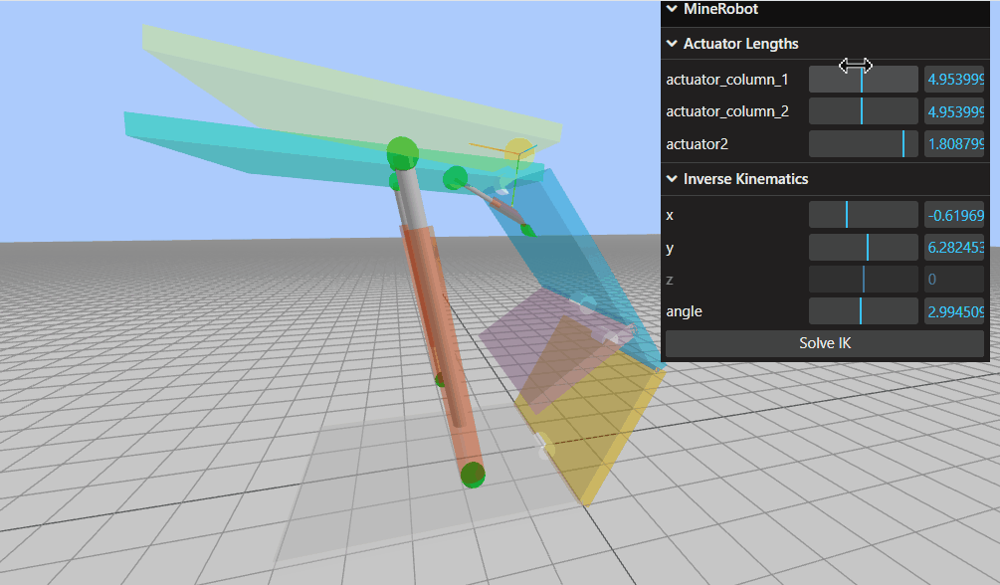
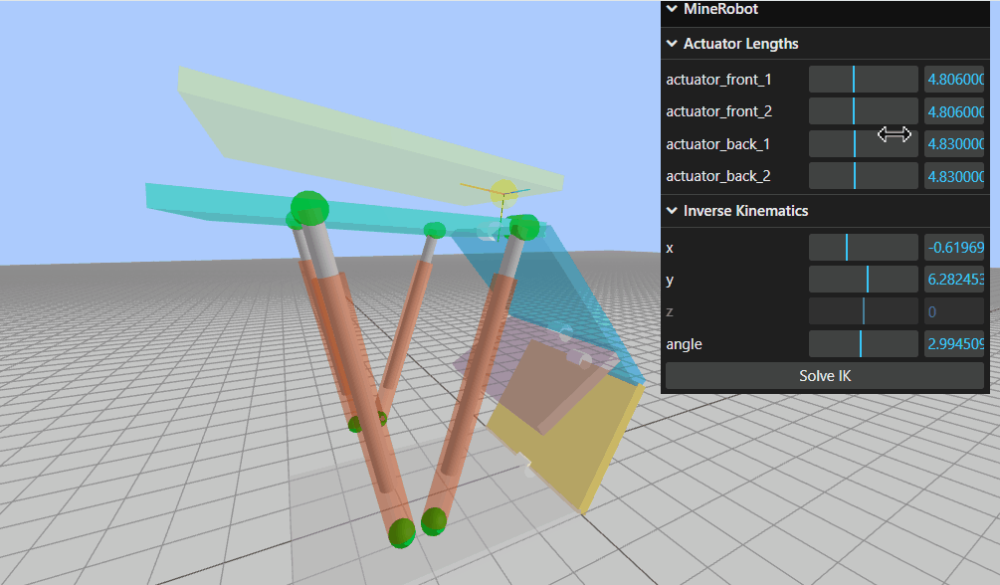
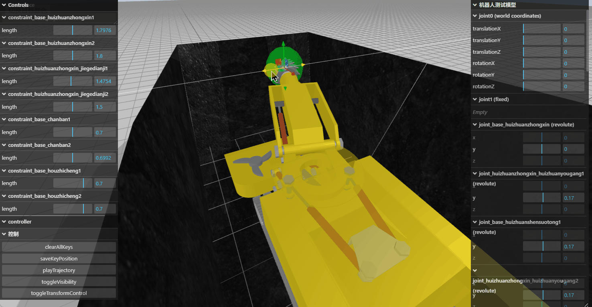
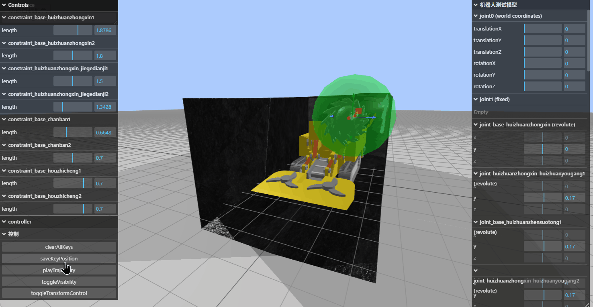
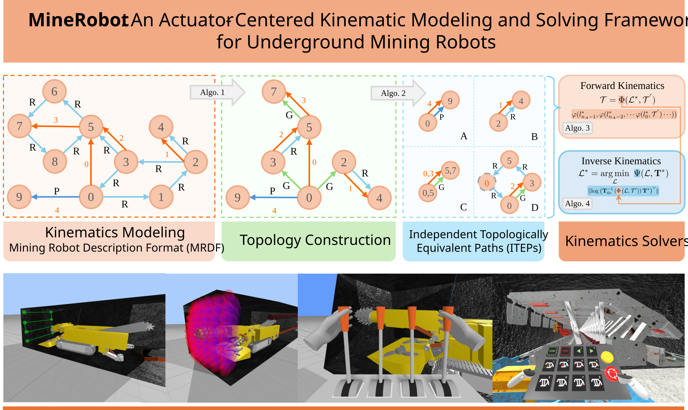

# MineRobot

This repository is the open-source demo for the paper *MineRobot: An Actuator-Centered Kinematic Modeling and Solving Framework for Underground Mining Robots*.

It is a lightweight implementation written in pure JavaScript and can be used interactively in a web browser.

- GitHub: <https://github.com/Housz/MineRobot>
- Online demo: <https://housz.github.io/MineRobot/>
  - **Shield-Type Hydraulic Support Robot:** [Online Demo](https://housz.github.io/MineRobot/demos/Shield-Type-Hydraulic-Support-Robot/index.html) | [MRDF File](https://github.com/Housz/MineRobot/blob/main/demos/Shield-Type-Hydraulic-Support-Robot/hydraulic_support.json)
  - **Top-Coal-Caving Hydraulic Support Robot:** [Online Demo](https://housz.github.io/MineRobot/demos/Top-Coal-Caving-Hydraulic-Support-Robot/index.html) | [MRDF File](https://github.com/Housz/MineRobot/blob/main/demos/Top-Coal-Caving-Hydraulic-Support-Robot/hydraulic_support.json)

<p align="center">
  
  
</p>

<p align="center">
  
  
  
</p>

The demo supports:

- Interactive adjustment of actuator lengths to test forward kinematics
- Interactive specification of the end-effector configuration and solving to test inverse kinematics

Due to copyright restrictions, this demo only provides the key structures of two hydraulic support robots built with basic shapes.
This project is only a simplified implementation of the paper for demonstration purposes.

<p align="center">
  
</p>

---

## Citation

If you find this work or code useful for your research, please cite our paper:

Hou, S., Lu, X., Zhang, T., Yan, C., & Zhang, X. (2026). MineRobot: An Actuator-Centered Kinematic Modeling and Solving Framework for Underground Mining Robots. Actuators, 15(7), 358. https://doi.org/10.3390/act15070358

```bibtex
@Article{act15070358,
AUTHOR = {Hou, Shengzhe and Lu, Xinming and Zhang, Tianyu and Yan, Changqing and Zhang, Xingli},
TITLE = {MineRobot: An Actuator-Centered Kinematic Modeling and Solving Framework for Underground Mining Robots},
JOURNAL = {Actuators},
VOLUME = {15},
YEAR = {2026},
NUMBER = {7},
ARTICLE-NUMBER = {358},
URL = {[https://www.mdpi.com/2076-0825/15/7/358](https://www.mdpi.com/2076-0825/15/7/358)},
ISSN = {2076-0825},
DOI = {10.3390/act15070358}
}